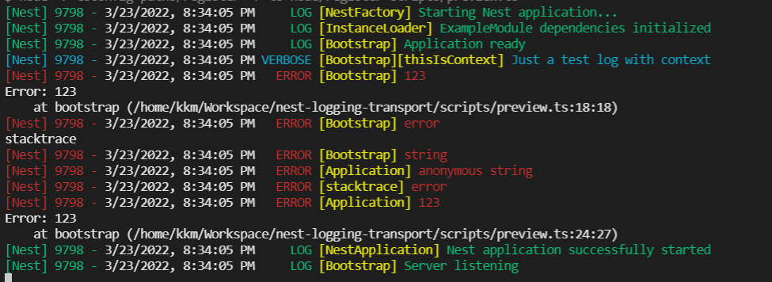

# Nest-logging-transport

Logger for [NestJS](https://nestjs.com/) framework allowing you to
use custom transports (or use predefined ones).

## Installation

yarn:

```sh
yarn add nest-logging-transport
```

npm:

```sh
npm i nest-logging-transport
```

## Usage

Nest-logging-transport allows you to either define your own transport, or use predefined ones.

Example with predefined transport:

```ts
import { NestTransportLogger, DefaultTransportConsole } from 'nest-logging-transport';

const customLogger = new NestTransportLogger({
    transports: [new DefaultTransportConsole()],
});

const bootstrap = async () => {
    const logger = new Logger('Bootstrap');
    const app = await NestFactory.create(ExampleModule, { logger: customLogger });
    logger.log('Application ready');
    [...]
    await app.listen(3334, () => logger.log('Server listening'));
};
```

From this moment all log calls will be redirected to `NestTransportLogger` instance and then
to each transport defined in instance constructor.

### Creating own transport

Creating own transport required implementing all methods from interface `Transport`.
To do it, simply create new object (or class):

```ts
import { Transport, LogEvent, LogEventWithReplacedNulls } from 'nest-logging-transport';

const customTransport = {
    log(event: LogEvent, eventWithoutNulls: LogEventWithReplacedNulls) {
        // [...]
    }
    // [...]
}
```

You can find examples in [src/transports](./src/transports/).

#### Difference between log events

To make operating on logs easier there is event with nulls replaced with empty strings `''`.
Normal log:

```js
{
  additionalContext: null,
  stacktrace: null,
  baseContext: 'Bootstrap',
  type: 'log',
  timestamp: 2022-03-23T19:26:59.295Z,
  message: 'Server listening'
}
```

Log with replaces nulls:

```js
{
  additionalContext: '',
  stacktrace: '',
  baseContext: 'Bootstrap',
  type: 'log',
  timestamp: 2022-03-23T19:26:59.295Z,
  message: 'Server listening'
}
```

Log functions in your logger can take event with nulls as first argument and without
nulls as the second one.

## Examples

Logs from default (console) transport looks like this:



You can also use preview script, available after cloning the repository:

```sh
yarn preview
```

## Publishing package (for package maintainers and forks)

Publishing this package is semi-automated.
Steps to do that:

1. Clone repository and checkout branch you want to release
2. Install dependencies from current lockfile `yarn install --frozen-lockfile`
3. Use release scripts:
   1. `yarn release`- in most cases, release script will take care of giving package the right number
   2. `yarn release:patch`- when you want to change only last part of semver (x.x.X)
   3. `yarn release:minor`- when you want to change middle part of semver (x.X.x)
   4. `yarn release:major`- when you want to change first part of semver (X.x.x)

You can read more about semver on [semver.org page](https://semver.org).

This project will follow semver from first major release (versions starting with 0 will be considered beta versions and will not follow semver).
